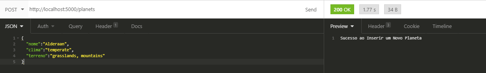
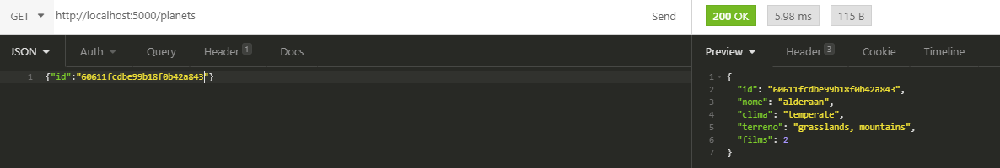
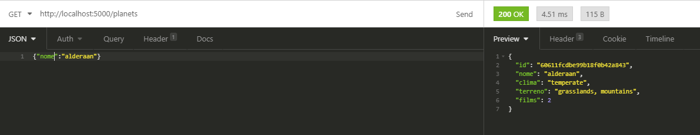
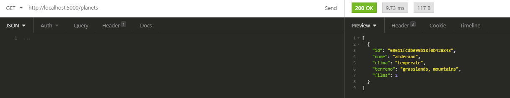
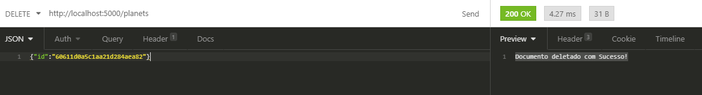

# STAR-WARS-CRUD-PLANETS


## Desafio ##

Nossos associados são aficionados por Star Wars e com isso, queremos criar um jogo com algumas informações da franquia.

Para possibilitar a equipe de front criar essa aplicação, queremos desenvolver uma API que contenha os dados dos planetas.

Requisitos:

- A API deve ser REST

Para cada planeta, os seguintes dados devem ser obtidos do banco de dados da aplicação, sendo inserido manualmente:

- Nome
- Clima
- Terreno


Para cada planeta também devemos ter a quantidade de aparições em filmes, que podem ser obtidas pela API pública do Star Wars: https://swapi.dev/about


Funcionalidades desejadas: 


- Adicionar um planeta (com nome, clima e terreno)

- Listar planetas

- Buscar por nome

- Buscar por ID

- Remover planeta

</br>
</br>

## Sobre o Projeto ##
API Rest de consulta, inserção e deleção de planetas do STAR WARS. Foi desenvolvida em GO juntamente com o MongoDB.


## Como Usar ##

Para começar a utilizar é preciso ter o docker instalado, disponível no [link](https://docs.docker.com/get-docker/). E também o Docker-Compose no [link](https://docs.docker.com/compose/install/).

Para dar um start nas aplicações basta usar o comando abaixo na raíz do projeto:

```
docker-compose up
```

<br>

## MongoDB ##
Mongo criado na porta:
```
localhost:27017
```
A conexão não precisa de nome nem senha, são utilizados o `Database: admin` e a `collection: planets`

<br>

## API Rest ##

A api atende chamdas de consulta no endpoint:

```
http://localhost:5000/planets
```

<br>

A API apresenta o método GET, POST e DELETE.


## Inserir Novo Planeta ##

Para inserir um planeta utlize o método POST passando um json no corpo da chamada:


Var         | Type        | Descrição
:-------    | :---------  |:---------
nome        | string      | Nome do planeta
clima       | string      | Tipo de clima do planeta
terreno     | string      | Tipo de terreno do planeta
<br>

Exemplo:

```json
{
	"nome":"Alderaan",
	"clima":"temperate",
	"terreno":"grasslands, mountains"
}
```

A resposta é uma string contendo:

<br>

Exemplo:
```json
Sucesso ao Inserir um Novo Planete
```


</br>
Exemplo no Insomnia




<br>
<br>

## Consulta de um Planeta Utilizando o ID ##

Para consultar um planeta utlizando seu id, use o método GET passando um json no corpo da chamada:


Var         | Type        | Descrição
:-------    | :---------  |:---------
id          | string      | ID do planeta

<br>

Exemplo:

```json
{
	{"id":"60611fcdbe99b18f0b42a843"}
}
```

A resposta é uma json contendo:

<br>

Var         | Type        | Descrição
:-------    | :---------  |:---------
id          | string      | ID do planeta
nome        | string      | Nome do planeta
clima       | string      | Clima do planeta
terreno     | string      | Terreno do planeta
films       | int64       | Quantidades de vezes que o planeta apareceu nos filmes

Exemplo:
```json
{
  "id": "60611fcdbe99b18f0b42a843",
  "nome": "alderaan",
  "clima": "temperate",
  "terreno": "grasslands, mountains",
  "films": 2
}
```

</br>
Exemplo no Insomnia



<br>
<br>


## Consulta de um Planeta Utilizando o Nome ##

Para consultar um planeta utlizando seu nome, use o método GET passando um json no corpo da chamada:


Var         | Type        | Descrição
:-------    | :---------  |:---------
nome        | string      | Nome do planeta

<br>

Exemplo:

```json
{
	{"nome":"alderaan"}
}
```

A resposta é uma json contendo:

<br>

Var         | Type        | Descrição
:-------    | :---------  |:---------
id          | string      | ID do planeta
nome        | string      | Nome do planeta
clima       | string      | Clima do planeta
terreno     | string      | Terreno do planeta
films       | int64       | Quantidades de vezes que o planeta apareceu nos filmes

Exemplo:
```json
{
  "id": "60611fcdbe99b18f0b42a843",
  "nome": "alderaan",
  "clima": "temperate",
  "terreno": "grasslands, mountains",
  "films": 2
}
```

</br>
Exemplo no Insomnia



<br>
<br>

## Consulta de todos os Planetas ##

Para consultar todos os planetas use o método GET sem nada no corpo da chamada:


A resposta é uma json contendo:

<br>

Var         | Type        | Descrição
:-------    | :---------  |:---------
id          | string      | ID do planeta
nome        | string      | Nome do planeta
clima       | string      | Clima do planeta
terreno     | string      | Terreno do planeta
films       | int64       | Quantidades de vezes que o planeta apareceu nos filmes

Exemplo:
```json
[
  {
    "id": "60611fcdbe99b18f0b42a843",
    "nome": "alderaan",
    "clima": "temperate",
    "terreno": "grasslands, mountains",
    "films": 2
  }
]
```
</br>
Exemplo no Insomnia



<br>
<br>

## Deletar um Planeta Utilizanndo o ID ##

Para remover um paneta  use o método DELETE passando o id no corpo da chamada:


Var         | Type        | Descrição
:-------    | :---------  |:---------
id          | string      | ID do planeta

<br>

Exemplo:

```json
{
	{"id":"60611fcdbe99b18f0b42a843"}
}
```

A resposta é uma string contendo:

<br>


Exemplo:
```json
  Documento deletado com Sucesso!
```
</br>

Exemplo no Insomnia

<br>
<br>

